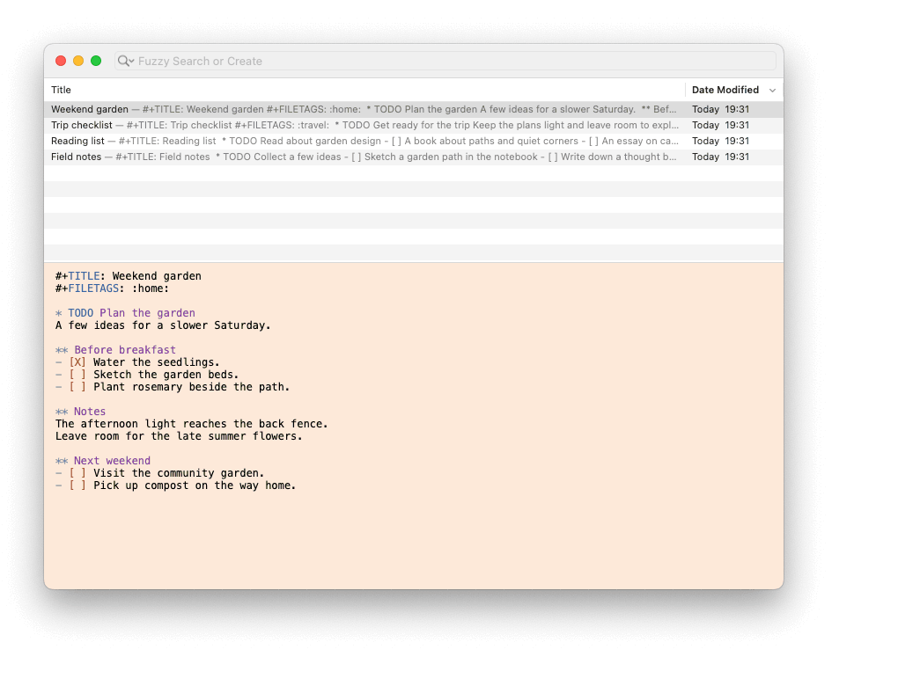

# Neo Notational V

Neo Notational V is a macOS notes app for editing source text. It also previews Markdown, Textile, HTML, and Org notes.

This fork of [ttscoff/nv](https://github.com/ttscoff/nv) adds multiple windows, fuzzy search, native macOS controls, and automatic backups. And removes support for SimpleNote sync.



[View a still screenshot](docs/screenshots/readme-source.png)

## What changes in this fork

**Importantly**, this fork makes the source code of notes editable while also making the rich-text un-editable. This is a big breaking change between upstream.

**Caution**, please make sure to backup existing notes if migrating to this fork from [ttscoff/nv](https://github.com/ttscoff/nv).

| Area | Upstream nvALT | This fork |
| --- | --- | --- |
| Windows | One main notes window. | Multiple windows, one shared notes list. |
| Layout | The notes list is stacked or side-by-side panes. | Each window supports stacked or side-by-side panes. |
| Search | Exact match strings on note titles. | Fuzzy searches on note title and text. Exact remains available. |
| Appearance | Legacy window controls and color schemes. | Native macOS controls and a notes list that follows system light and dark modes. |
| Editor | Editable rich-text in Markdown, Textile, and HTML(?). | Editable source with syntax-highlighting and readonly rich-text previews  in MD, Textile, HTML, Org|
| Preview | Non-editable source code | Non-editable rich-text |
| Data Sync | SimpleNote supported | Unsupported |

Saved windows retain their stacked or side-by-side layout. The fork retains note links, tags, source import/export, and custom editor fonts.

### Multiple windows

Each window can show a different note or search. Edits to the same note appear in all windows that show that note. Undo and Redo share the history for that note, including committed title and tag edits.

The app restores open windows and their saved views after a restart. A change to the notes library applies to all windows.


### Search

Choose **Fuzzy** or **Exact** from the search-field menu.
Fuzzy matches characters in order, so `mtg` can match `meeting`. It searches titles, tags, and complete committed source text.
Double quotes require a contiguous phrase. Spaces and colons separate terms, and other punctuation remains literal.

Each matching title, tag, or body line has a separate result, in the order returned by [`dangduc/fzf-native`](https://github.com/dangduc/fzf-native).
A note can appear more than once.


### Native controls and appearance

The search field fills a row directly below the window title bar, above the notes list.
**View > Notes List on Side** (Command-Option-L) places the list to the left of the editor in the current window.
Each window saves its layout and divider sizes.

**View > Search in Title Bar** moves Search beside the window controls on macOS 11 or later.
This setting applies to all windows and persists after restart.
Note commands remain available through menus and shortcuts.

The **View** menu can show or hide the notes list, title, tags, and Source/Preview controls.
These visibility preferences apply to all windows.
Hidden rows release space to the body. Showing the notes list restores each window's previous divider size.
**Note > Rename** and **Note > Tag** reveal hidden fields before editing.
Tags offer completion from the library.

The notes list follows system light and dark appearance.
The editor can follow the system appearance or use custom colors and fonts.
Choose **View > Color Schemes > Follow System Appearance** for system editor colors.
**User Scheme** uses separate custom light and dark colors and switches with the macOS appearance.
**Preferences > Fonts & Colors** contains both groups, each with search highlight, foreground text, and background colors.

User Scheme uses these default sRGB colors. Saved custom colors take precedence.

| Appearance | Text | Background | Search highlight |
| --- | --- | --- | --- |
| Light | `#000000` | `#FDE9D9` | `#F5C1C0` |
| Dark | `#000000` | `#FFEFC9` | `#FFC600` |

To customize syntax highlighting, open **Preferences > Fonts & Colors > Syntax Colors…**.
The matrix provides seven categories for light backgrounds and seven for dark backgrounds.
User Scheme selects the syntax palette from the editor background brightness.
Changes appear immediately. **Restore Syntax Defaults** restores both syntax palettes.


All screenshots use disposable sample notes.
[Screenshot details](docs/screenshots/README.md) record the captured revision and environment.

## Use the app

| Action | Instruction |
| --- | --- |
| Open another window | Choose **Window > New Window**, or press **Command-Shift-N**. |
| Create a note | Press **Command-N**. If the search field has focus and contains text, that text becomes the title. |
| Find a note | Type in **Search or Create**. Use **Command-J** or **Command-K** to move through the results. |
| Edit a search result | Select the note. Then press **Return**. |
| Create from a search | If no note matches, press **Return** or click **Create**. |
| Create from any search | With the search field focused, press **Command-Return**. The current search text becomes the new title, even with matching results. |
| Edit the title | Choose **Note > Rename**. Press **Return** to commit, or **Escape** to cancel. |
| Edit tags | Choose **Note > Tag**. Press **Return** to commit, or **Escape** to cancel. |
| Resize the list | Drag the divider between the list and the editor. |
| Use system editor colors | Choose **View > Color Schemes > Follow System Appearance**. |
| Open a preview | Choose **Preview > Preview Format**, then select Markdown, Textile, HTML, or Org. |
| Return to editing | Choose **Preview > Show Source**. |
| Select source syntax | Choose **View > Syntax Type**, then select Plain Text, Markdown, Textile, HTML, JSON, or Org. |
| Show optional controls | Use the title, tag, and Source/Preview visibility commands in **View**. |
| Show or hide the notes list | Choose **View > Show Notes List** or **Hide Notes List**. |
| Manage backups | Open **Preferences > Backups**. |

## Automatic backups

Automatic backups run while Neo Notational V is open, with a default 15-minute interval.
Unchanged libraries do not create duplicate automatic snapshots.
**Preferences > Backups** controls the destination, interval, and retention.
It also offers **Back Up Now**, **Show Backups in Finder**, and **Restore Backup…**.
A restore opens the backup in a new, empty folder and leaves the original library in place.
[Backup usage](docs/automatic-backups.md) describes snapshot contents, encryption, and recovery limits.

## Automated builds

The [macOS build workflow](https://github.com/dangduc/nv/actions/workflows/macos.yml) runs for pull requests to `master`, pushes to `master`, and manual runs.
It uses an Intel macOS 15 runner with Xcode 16.4.

1. Open a successful workflow run.
2. Download `Neo-Notational-V-macos-x86_64-<run number>-<attempt>.zip` from **Artifacts**.
3. Extract `Neo Notational V.app` from the ZIP file.

Downloads require a GitHub login. App archives expire after 30 days.
These are unsigned builds with the release identity without notarization. Apple Silicon Macs require Rosetta.

Successful `master` builds create a `build-<run number>` tag at the built commit.
A rerun keeps the same tag. Pull requests and manual runs on other branches do not create tags.
Build tags do not change the app version or create GitHub Releases.

CI checks tag logic, native search behavior, and the app build. It also checks executable permissions in the archive.
The desktop integration suites remain separate. [Tests/CI/README.md](Tests/CI/README.md) describes the CI checks and tag rules.

## Dependency changes

This fork uses `NSJSONSerialization`, `NSDataDetector`, and an inline `WKWebView` preview.
Automatic updates and the Check for Updates menu items are disabled.

HTML files, web archives, and web-page downloads cannot be imported.
Pasted URLs remain plain text. Browser paste uses a plain-text representation when available.
The `nvalt://make` action accepts `txt`; its `html` and `url` import parameters are disabled.
You can type or paste HTML source and select the HTML viewer. Rendered HTML export remains available.

## Build and run

The build requires full Xcode. Command Line Tools alone are insufficient.
The bundled MultiMarkdown executable and OpenSSL archive require an Intel build. Apple Silicon Macs need Rosetta.

The command below passed on macOS 26.5.2 with Xcode 26.6 and the macOS 26.5 SDK. Other runtime versions need separate checks.

1. Clone this fork:

   ```sh
   git clone https://github.com/dangduc/nv.git
   cd nv
   ```

2. Build the Development app:

   ```sh
   xcodebuild -project Notation.xcodeproj -scheme 'Notation Develop' \
     -derivedDataPath build/DerivedData ARCHS=x86_64 \
     MACOSX_DEPLOYMENT_TARGET=10.13 CODE_SIGNING_ALLOWED=NO \
     GENERATE_PROFILING_CODE=NO OTHER_CFLAGS= WARNING_LDFLAGS= build
   ```

3. Run the app beside your release copy:

   ```sh
   open "build/DerivedData/Build/Products/Development/Neo Notational V Development.app"
   ```

The Development app has a separate name, a DEV Dock badge, and its own settings and default notes library.
It does not copy release preferences or automatically import the legacy database.
You can change its notes folder, colors, and backup settings independently.

| Location or identity | Release | Development |
| --- | --- | --- |
| App | `Neo Notational V.app` | `Neo Notational V Development.app` |
| Preferences domain | `net.elasticthreads.nv` | `net.elasticthreads.nv.development` |
| Default notes folder under `~/Library/Application Support/` | `Notational Data` | `Notational Data Development` |
| Support and backup folder under `~/Library/Application Support/` | `nvALT` | `nvALT Development` |
| Note link scheme | `nvalt://` | `nvalt-dev://` |

The rename preserves existing settings, notes folders, backup paths, and note links.

Development adds an `nvALT Development` subfolder inside a custom backup destination, so copied libraries retain separate backup histories.
Custom notes locations remain your choice. Use separate notes folders while both apps run.
To try existing notes, import source files or restore a backup into a separate development folder.
Opening the same notes folder in both apps does not provide coordinated editing between processes.

For a release build, use the same command with `-scheme 'Notation Release'`.
The release app is `build/DerivedData/Build/Products/ForBuilding/Neo Notational V.app` and uses existing release settings and notes.
The built-in updater is disabled. Updates require a new local build or CI artifact.

## Development checks

### Project layout

| Directory | Contents |
| --- | --- |
| `Sources/` | Application code, grouped by responsibility. Headers stay beside their implementations. |
| `Resources/` | Images, help, syntax queries, interfaces, and localized resources in `Localization/*.lproj/`. |
| `Config/` | Application plist, prefix header, and linker order files. |
| `ThirdParty/` | Bundled source dependencies, markup processors, and OpenSSL. |
| `Scripts/` | Development utilities. |
| `Tests/` | Cocoa integration suites, regression checks, CI checks, and review records. |
| `docs/` | Documentation assets and screenshots. |

`Notation.xcodeproj` stays at the repository root. Its navigator groups match the directories on disk.

### Run the suites

After a Development build, run these commands from an active desktop session:

```sh
python3 Tests/run-multiple-windows-tests.py
python3 Tests/run-regression-tests.py
```

The suites use temporary notes and a copy of the app. They cover shared edits, Undo/Redo, window restoration, search, metadata, preview ownership, and appearance.

[Tests/README.md](Tests/README.md) describes focused checks and full-screen checks. [The review record](Tests/NativeUIReview/VALIDATION.md) lists results and limits. External editor apps need separate manual checks.

## Source and preview

New notes start as editable Plain Text. The syntax menu enables Tree-sitter highlighting for Markdown, HTML, JSON, and Org.

Org source highlights headings, tags, properties, lists, checkboxes, timestamps, links, tables, blocks, default TODO/DONE keywords, and ordinary emphasis.
Importing an `.org` file selects Org syntax and preserves its source encoding.
Existing file libraries recognize `.org` files without changing their selected output extension.
Org web links open their URL. File, ID, and heading targets remain source text without an action.
Org syntax does not provide agenda views, folding, task commands, or embedded-language highlighting.
Textile source supports markup insertion commands with plain display.
Simplenote support is removed. Existing local notes remain available.
Syntax settings stay in the local library. They are independent of each window's preview format.

Each window can edit Source or show a read-only preview of the same note.
Switching modes retains the source, Undo, caret, and scroll position. Existing composition commits only in the editor being hidden.
Markdown preview uses MultiMarkdown. Org preview uses a bundled Orgize converter.
Preview and Save HTML use the same rendered result.

Org preview shows headings, emphasis, task labels, lists, tables, links, and literal code or example blocks.
Code stays text, and include directives remain visible without loading other files.
Choose **Preview > Preview Format > Org** to view any note as Org, independently of its source syntax.
The converter does not require an installed Rust toolchain, Pandoc, or Emacs.
Custom Emacs export settings, macros, footnotes, and agenda views are outside this viewer's scope.


Preview offers selection, Copy, Find, and HTML export. Printing requires macOS 11 or later.

Notes can use a single database or separate plain-text files.
Plain-text paste and imports preserve source characters, whitespace, and line endings.
Text imports retain their original bytes, encoding, and byte-order mark where possible.
An edit that cannot use the original encoding offers UTF-8 conversion.

Rich-text notes, rich-text import/export, detached previews, sticky previews, sharing, and custom templates are no longer supported.
The viewer blocks active note scripts and remote resources. Passive local assets can load from the note's directory.
Quick Look previews are not included.

## Contribute and credits

[architecture.md](architecture.md) explains controller ownership, shared editing, storage, and window lifecycle.

[AGENTS.md](AGENTS.md) describes the source layout, coding conventions, and pull request requirements. Reports about this fork belong in [dangduc/nv issues](https://github.com/dangduc/nv/issues).

Neo Notational V is based on nvALT by Brett Terpstra and David Halter. It builds on Zachary Schneirov's [Notational Velocity](https://github.com/scrod/nv) and [DivineDominion's MultiMarkdown fork](https://github.com/DivineDominion/nv).

The repository includes the [GNU General Public License, version 3](COPYING.txt). Bundled components retain their own license notices.
