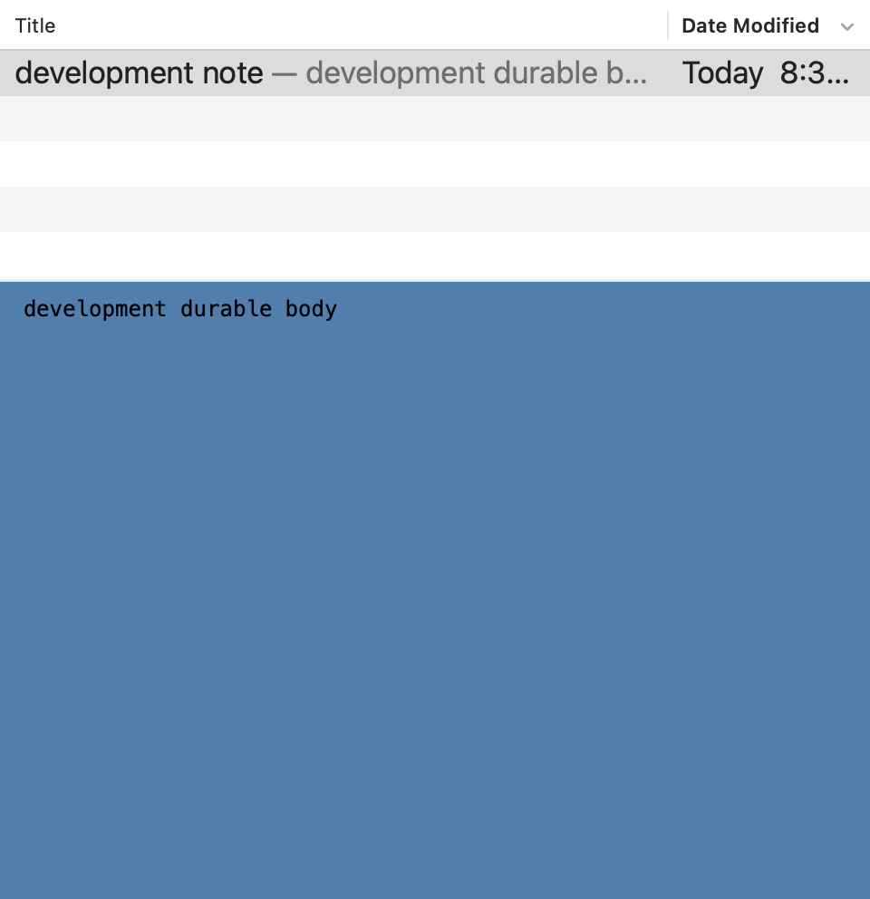
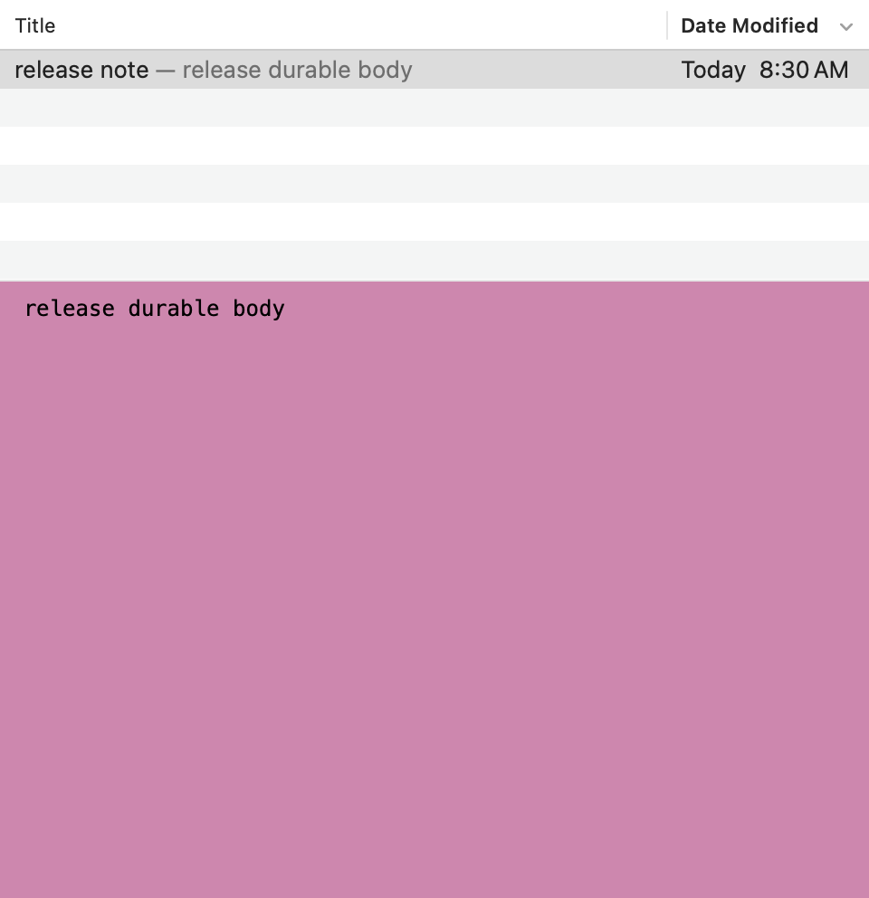

# Development build validation

Host: macOS 26.5.2 (25F84), Xcode 26.6 (17F113). Applications use Intel binaries through Rosetta.

At implementation commit `2dbfd46`:

- `Notation Develop` and `Notation Release` builds passed with the documented unsigned Intel options.
- Both built apps passed `.github/scripts/check-app-identity.py`.
- The release ZIP passed `.github/scripts/check-app-archive.py`.
- All 23 CI unit tests passed.
- `runtime/run.py` passed Development, release, and missing-flavor cases.
  It covers temporary paths, intercepted keychain operations, and automatic legacy import.
  The probe does not call the real keychain API.

The required desktop suites ran against the renamed Development app:

- Multiple Windows passed normal operation and relaunch checks, then exited 245 after opening the replacement library.
- The regression suite passed through source analysis, editing, wrapping, and native fuzzy-search checks.
  It stopped at `FuzzySearch/UI`: `FAIL: fuzzy workflow owns active disposable browser`.

Both failures match the existing [baseline record](../TypingPerformance/VALIDATION.md#regression-baseline).
Later tests in the aggregate command did not run after its first failure.
The source-analysis and Org-link fixtures now include the new identity header when they extract production link methods.

The applications still require separate custom notes folders when both processes run.
The isolation does not coordinate simultaneous writes to a deliberately shared library.

`run-tests.py --output build/DevelopmentBuild` passed 138 in-app checks, plus bundle metadata and concurrent-process checks.
Both apps ran together during the first launch and again during relaunch.
The probe checked notes, backup payloads, font/color preferences, separate paths, legacy-import behavior, and the DEV badge state.
The copied apps used unique test preference domains and redirected filesystem roots.
Real keychain and external-editor integration remain outside this test's scope.

Native content snapshots show independent color and font settings in disposable notes:

| Development | Release |
| --- | --- |
|  |  |

These AppKit bitmaps contain the content view. They do not capture the system Dock or window frame.

After round 2, the backup store passed 390 assertions and the backup coordinator suite passed.
New cases cover first publication under a custom Development namespace, private directory permissions,
separate deletion for a copied UUID, invalid namespaces, and unavailable selected roots.

Round 3 reviewed production commit `47d18f4`.
The complete-app [custom-backup runner](../DevelopmentBuildReview/round3/ousterhout/run.py) passed 252 assertions across four processes.
Development and release ran together during first launch and relaunch.
Both published and decoded default, first manual custom, and first automatic custom snapshots.
Each Development custom destination started without its namespace folder.
The automatic case invokes the due-check entry point; it does not wait for the timer.

The full store passed 169 checks across five reopened processes with the same library UUID in both flavors.
First publication created the missing namespace, and each retention or deletion preserved the peer's snapshot identifiers and archive bytes.
Separate native descriptor checks passed 1,603 assertions on each architecture, with unchanged descriptor counts after successful and rejected operations.
The individual [review records](../DevelopmentBuildReview/README.md) distinguish complete-app checks from extracted-method and store-only evidence.

The final correction is commit `9a69037`.
It canonicalizes the bookmarked backup parent before appending the Development namespace.
The reviewer verified the corrected publication and deletion data flow from source.
Both Intel configurations rebuilt successfully, both identity checks passed, and the final release ZIP passed its archive check.
The backup store again passed 390 assertions, and the backup coordinator suite passed.
The complete-app custom-backup runner again passed all 252 assertions against these rebuilt apps.
Its separate [post-fix results](../DevelopmentBuildReview/round3/ousterhout/post-fix/results.json) preserve the original round-three evidence.

All three rounds and 18 subagent reviews are complete.
The four P2 findings were corrected after their respective rounds.
The documented aggregate desktop-suite failures remain unchanged; the focused passing checks do not supersede those limits.
