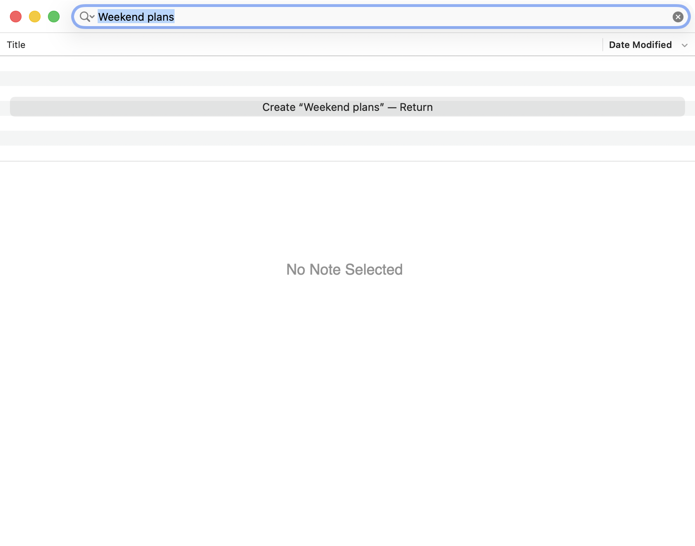
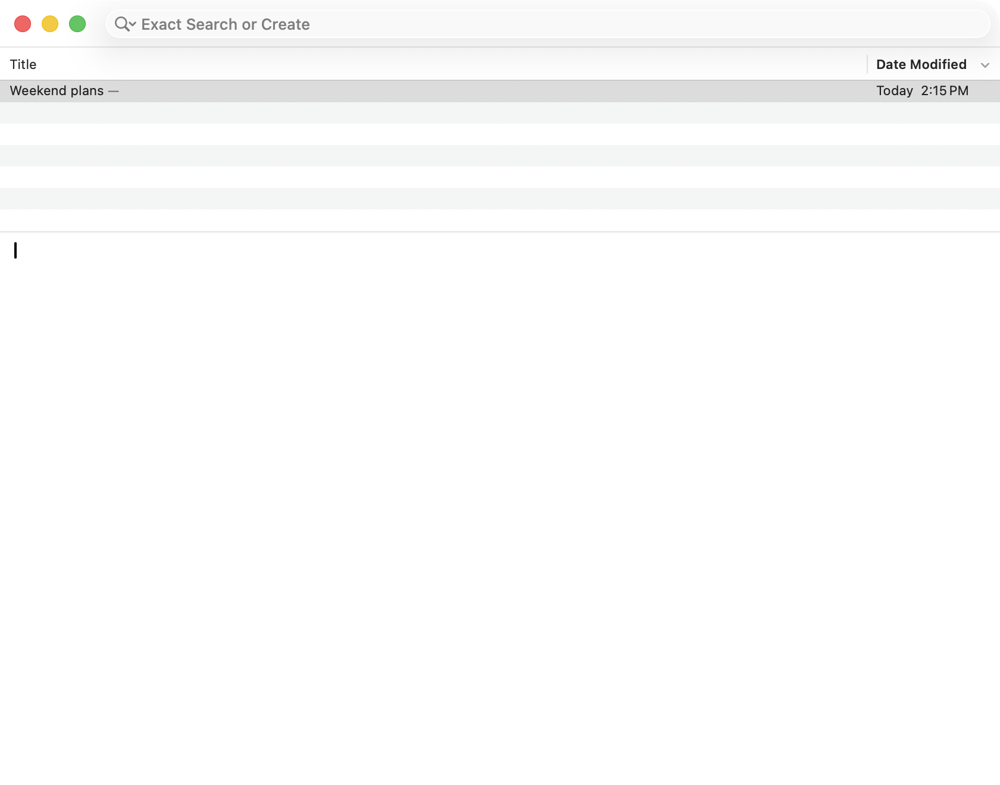

# Focused search and New Note

PR [14](https://github.com/dangduc/nv/pull/14) changes Command-N when the search field has focus and contains text.
The complete field text becomes the new note title. An empty field or focus elsewhere uses the existing default title.
Application commit `504f30353275663d5174656b03805625275e603a` contains the implementation and maintained keyboard checks.
Later review commits contain evidence and documentation.

## Validation

The Intel Development build passed on macOS 26.5.2 (25F84), with Xcode 26.6 (17F113), through Rosetta.
The application executable SHA-256 was `ffd2506757bfb23cfc26450ce1a736a578babd22af606a313427a6db7e399c43`.
This hash records the tested local build. It is not a requirement for other builds.

```sh
python3 Tests/Regression/native-controls/run.py --probe new-note
```

The maintained group passed 101 checks, including menu dispatch, focus, composition, pending searches, and independent browser windows.
The existing Create and ordinary New Note checks also passed in the native UI suite.
That suite then reached its previously recorded Undo exception: index 16, string length 11.
The required multiple-window suite reached its previously recorded Undo exception: index 13, string length 12.
Aggregate regressions passed native search checks, then stopped at the previously recorded fuzzy-app activation assertion.
The complete desktop suites are not green.

## Reviews

Each named perspective is inspired by that engineer's priorities. These reports do not claim their authorship or endorsement.
All reviewers wrote and ran executable evidence in copied apps with disposable libraries and preferences.
The runner uses `build/pr-review/gui.lock` to serialize desktop access.
Reports describe fixture corrections and the limits of each probe.

| Round | Perspective | Result | PR comment |
| --- | --- | --- | --- |
| 1 | [Ousterhout](round1/ousterhout/report.md) | 20 checks passed; no actionable findings | [Comment](https://github.com/dangduc/nv/pull/14#issuecomment-5608874569) |
| 1 | [Luu](round1/luu/report.md) | 53 checks passed; no actionable findings | [Comment](https://github.com/dangduc/nv/pull/14#issuecomment-5608876612) |
| 1 | [Torvalds](round1/torvalds/report.md) | 11 checks passed; no actionable findings | [Comment](https://github.com/dangduc/nv/pull/14#issuecomment-5608878601) |
| 1 | [Kingsbury](round1/kingsbury/report.md) | 45 checks passed across two launches; no actionable findings | [Comment](https://github.com/dangduc/nv/pull/14#issuecomment-5608897803) |
| 1 | [Contrarian](round1/contrarian/report.md) | 23 checks passed; deliberate stale-query mutation rejected | [Comment](https://github.com/dangduc/nv/pull/14#issuecomment-5608911988) |
| 2 | [Ousterhout](round2/ousterhout/report.md) | 27 checks passed; no actionable findings | [Comment](https://github.com/dangduc/nv/pull/14#issuecomment-5608937335) |
| 2 | [Luu](round2/luu/report.md) | 45 checks passed; no actionable findings | [Comment](https://github.com/dangduc/nv/pull/14#issuecomment-5608942370) |
| 2 | [Torvalds](round2/torvalds/report.md) | 16 checks passed; no actionable findings | [Comment](https://github.com/dangduc/nv/pull/14#issuecomment-5608948851) |
| 2 | [Kingsbury](round2/kingsbury/report.md) | 44 checks passed; existing decomposed-title behavior reproduced | [Comment](https://github.com/dangduc/nv/pull/14#issuecomment-5608994028) |
| 2 | [Contrarian](round2/contrarian/report.md) | 16 checks passed; deliberate focus-guard mutation rejected | [Comment](https://github.com/dangduc/nv/pull/14#issuecomment-5608998118) |

Both rounds are complete. Each second-round reviewer examined the first-round evidence and added a different probe.
No actionable findings were attributed to the PR, and the reviews required no production changes.
Check counts include setup assertions. Separate probes can cover overlapping behavior; counts do not measure coverage.

The file-storage review records one existing behavior with decomposed Unicode titles.
On reopening, filename reconciliation can replace the title with its sanitized filename, including punctuation changes.
The retained legacy creation path reproduces the same failure in the current binary.
The report includes both failing runs and distinguishes this control from a separate baseline build.

## Screenshots

These WindowServer captures show an Exact search for “Weekend plans” and the note created by Command-N.
They use an isolated library, the application build above, and the default hidden header rows.
The new source is empty and the new note appears in the notes list.
Both images were captured on September 9, 2026, and inspected without pixel edits.
The screenshot probe passed eight assertions.

| Focused search | After Command-N |
| --- | --- |
|  |  |
