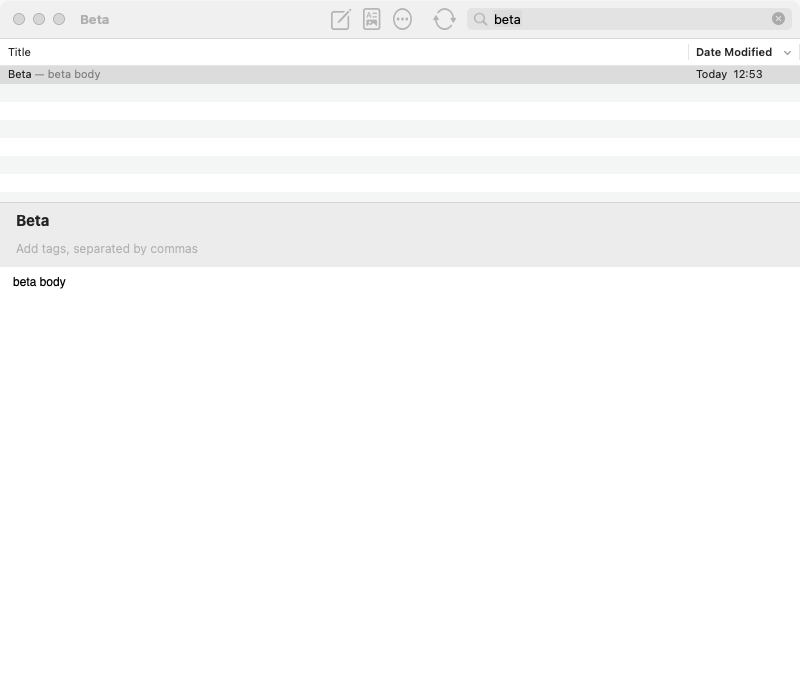
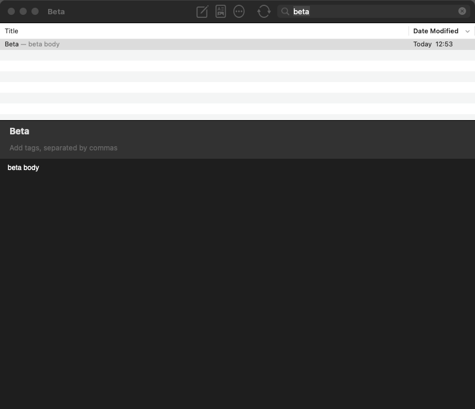

# Native browser UI review

This review covers the changes from `116daff` through `10de8a4`, followed by corrections from three review rounds.

The six AI review perspectives use methods associated with John Ousterhout, Dan Luu, Linus Torvalds, and Kyle Kingsbury. Two additional perspectives challenge workflow compatibility and the test evidence. The named people did not participate.

Each round records all six perspectives before corrections begin. Reports identify the reviewed source, executable probes, observed results, limitations, and actionable findings. GUI probes use copied apps, temporary notes, separate preferences domains, and `build/pr-review/gui.lock`.

Historical defect probes can fail after corrections. Use each report's reviewed revision and build instructions to reproduce its observations. Use `Tests/Regression/` for current acceptance checks.

## Review rounds

| Round | Reviewed production | Status |
| --- | --- | --- |
| 1 | `10de8a4` | All six perspectives complete. Five product defects and one test coverage gap corrected by three implementation agents. |
| 2 | `12936fe` | All six perspectives complete. No new actionable findings; the workflow baseline comparison remains limited. |
| 3 | `12936fe` at `0afeb03` | All six perspectives complete. The white-list coverage gap is corrected and its removal fault is detected. |

Round 1 reports: [Ousterhout](round1/ousterhout/report.md), [Luu](round1/luu/report.md), [Torvalds](round1/torvalds/report.md), [Kingsbury](round1/kingsbury/report.md), [workflow contrarian](round1/workflow_contrarian/report.md), and [test contrarian](round1/test_contrarian/report.md).

The [round 1 correction record](round1/corrections.md) maps each finding to its fix and acceptance evidence.

The [validation record](VALIDATION.md) includes the corrected build's full-screen checks and light/dark captures.

Round 2 reports: [Ousterhout](round2/ousterhout/report.md), [Luu](round2/luu/report.md), [Torvalds](round2/torvalds/report.md), [Kingsbury](round2/kingsbury/report.md), [workflow contrarian](round2/workflow_contrarian/report.md), and [test contrarian](round2/test_contrarian/report.md).

Round 3 reports: [Ousterhout](round3/ousterhout/report.md), [Luu](round3/luu/report.md), [Torvalds](round3/torvalds/report.md), [Kingsbury](round3/kingsbury/report.md), [workflow contrarian](round3/workflow_contrarian/report.md), and [test contrarian](round3/test_contrarian/report.md).

The [round 3 correction record](round3/corrections/list-report.md) records the rendered-list guard and its negative control. Across the three rounds, agents corrected five product findings and two coverage gaps. Final validation passed both required suites and the optional full-screen run.

## Initial screenshots

These snapshots show the UI at `10de8a4`. The notes list stays white in both appearance modes.

