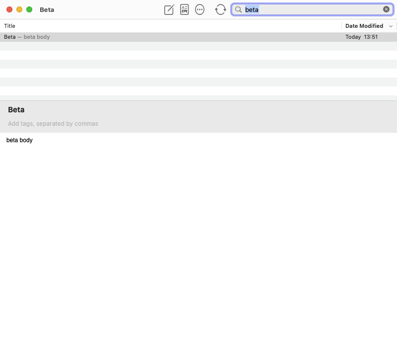
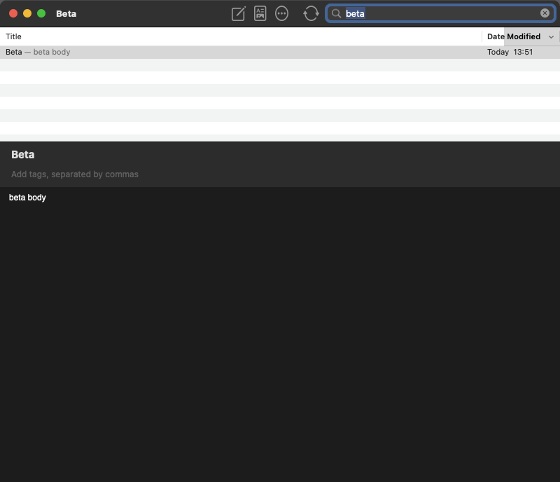

# Native UI validation

## Corrected build

Production revision `12936fe` passed the full regression suite and the multiwindow suite.
The environment was macOS 13.7.8, Xcode 15.2, and the macOS 14.2 SDK.
The x86_64 Development build ran under Rosetta with the documented deployment overrides.

The optional full-screen run passed 71 native UI checks on an unlocked desktop.
AppKit confirmed entry and exit while both panes retained their vertical stack.
This supersedes the earlier locked-desktop limitation recorded during initial validation.

```sh
mkdir -p build/NativeUIReview/current-captures
NV_UI_FULL_SCREEN=1 NV_UI_ARTIFACTS="$PWD/build/NativeUIReview/current-captures" \
  python3 Tests/Regression/native-ui/run.py
```

The captures contain only synthetic notes from the disposable test library.





## Final acceptance checks

All three rounds of six review perspectives are complete. The final white-list correction changes only tests and documentation; the production app remains at `12936fe`.

The final full regression suite passed, including 82 native UI checks, 84 control checks, and 438 rendering checks. The multiwindow suite passed 35 checks and 13 relaunch checks. The optional full-screen run passed 89 checks, including four row-capture assertions.

The native UI fixture now measures both unselected row parities during Aqua and Dark Aqua transitions. It requires opaque, pale backgrounds and visible dark title glyphs. The original appearance-removal fault fails the new background assertion after 79 passing assertions. The unmodified artifact-enabled fixture passes 86 assertions.

```sh
python3 Tests/run-regression-tests.py
python3 Tests/run-multiple-windows-tests.py
mkdir -p build/NativeUIReview/final-captures
NV_UI_FULL_SCREEN=1 NV_UI_ARTIFACTS="$PWD/build/NativeUIReview/final-captures" \
  python3 Tests/Regression/native-ui/run.py
python3 Tests/NativeUIReview/round3/corrections/run-list-canary.py
```

The [correction record](round3/corrections/list-report.md) contains the canary outputs and captures. GitHub reports no checks for this PR; the validation above ran locally.

## Limits

Live sync services and external editor applications require separate manual checks.
This validation does not establish behavior on other macOS versions.
Ventura logs a layout warning inside AppKit's adaptive search toolbar item.
The resize, control, and full-screen checks passed despite that warning.
