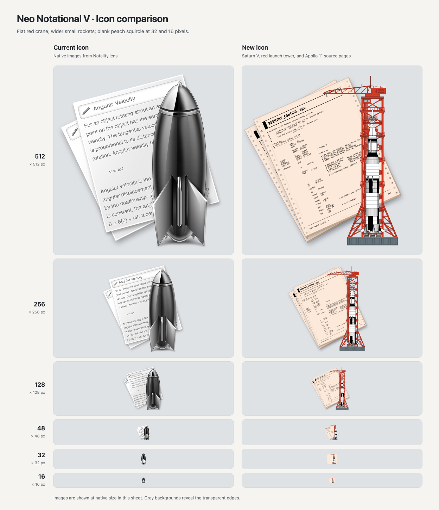

# App icon artwork

The icon combines peach Apollo 11 source pages, a red launch tower, and a Saturn V.
See [SOURCES.md](SOURCES.md) for artwork credits.

## Components

| File | Purpose |
| --- | --- |
| `source-page.svg` | Two sheets of `#FDE9D9` continuous-feed paper with the AGC code listing. |
| `launch-tower.svg` | Red crane and launch tower in a flat front view. |
| `saturn-v.svg` | Vertical Saturn V drawing for sizes of 128 pixels and larger. |
| `small/saturn-v-48.svg` | Rocket with twice the main drawing's width. |
| `small/saturn-v-32.svg` | Rocket with 2.5 times the main drawing's width. |
| `small/saturn-v-16.svg` | Rocket with 3.5 times the main drawing's width. |
| `small/squircle-background.svg` | Blank peach background for the 32px and 16px designs. |

Each SVG uses a transparent 1024 × 1024 canvas.
The composition puts the crane behind the rocket.
Earlier white-paper and perspective-crane revisions are preserved in `revisions/`.

## Compose the SVGs

Run this command from the repository root:

```sh
python3 docs/artwork/app-icon/compose.py
```

This command needs only Python's standard library.
It updates `icon-composition.svg` and writes four composed SVGs plus HTML previews to `build/app-icon-design/`.
The main composition serves the 128px, 256px, and 512px sizes.
Separate compositions serve 48px, 32px, and 16px.

## Build the app icon

Use macOS with Google Chrome and Python with Pillow installed.
The current resource was rendered with Pillow 12.2.0 and Chrome 153.0.8010.53.

```sh
python3 -m pip install 'Pillow==12.2.0'
python3 docs/artwork/app-icon/build-icon.py
```

The build script composes the SVGs, renders each size, and replaces `Resources/Images/Notality.icns`.
Chrome runs with a temporary profile and closes after each render.
The script writes intermediate PNGs into `build/app-icon-design/NeoNotationalV.iconset/`.

The ICNS file contains 1× and 2× entries for 16px, 32px, 128px, 256px, and 512px, plus a 48px entry.
Each Retina entry uses its logical size's design.
For example, the 16px Retina entry uses the 16px rocket and squircle at 32 × 32 pixels.
The script decodes every ICNS entry and checks its pixels against the rendered PNG before replacing the resource.

To save a candidate without replacing the app resource, use `--output`:

```sh
python3 docs/artwork/app-icon/build-icon.py --output build/candidate.icns
```

Use `--chrome /path/to/chrome` to select another Chrome executable.

## Preview


