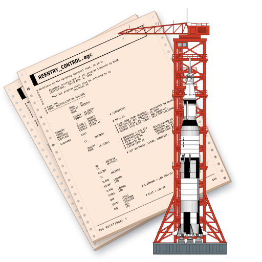
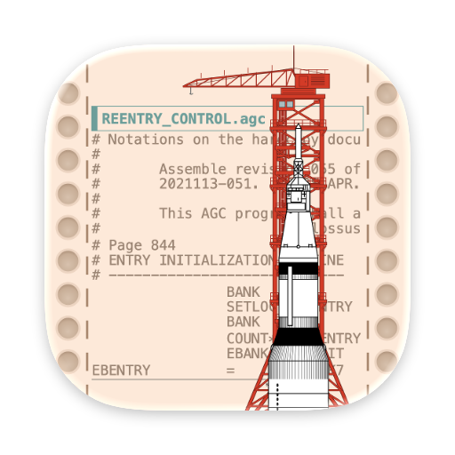

# App icon artwork

The app includes two icon sets: classic pages and a squircle.
Both sets combine peach Apollo 11 source paper, a red launch tower, and a Saturn V.
macOS 26 and later select the squircle. Earlier systems select the classic pages.
See [SOURCES.md](SOURCES.md) for artwork credits.

## Components

| File | Purpose |
| --- | --- |
| `source-page.svg` | Two sheets of `#FDE9D9` continuous-feed paper with the AGC code listing. |
| `squircle-paper.svg` | Peach squircle with shaded feed holes and perforations along both sides. |
| `launch-tower.svg` | Red crane and launch tower in a flat front view. |
| `saturn-v.svg` | Vertical Saturn V drawing for sizes of 128 pixels and larger. |
| `small/saturn-v-48.svg` | Rocket with twice the main drawing's width. |
| `small/saturn-v-32.svg` | Rocket with 2.5 times the main drawing's width. |
| `small/saturn-v-16.svg` | Rocket with 3.5 times the main drawing's width. |
| `small/squircle-background.svg` | Blank peach background for the 32px and 16px designs. |

Each SVG uses a transparent 1024 × 1024 canvas.
The composition puts the crane behind the rocket.
At 48px and larger, the squircle uses one upright sheet and the original code listing.
The squircle uses larger code text, cropped to the paper margins.
Its SVG retains all 59 source rows, including rows outside the visible crop.
Its enlarged foreground is clipped to the squircle outline.
The crane antenna touches the top edge, and the gray platform falls below the bottom edge.
The Saturn V has an additional 2× scale anchored at its own antenna tip.
The hole marks have opaque shading to preserve the solid background.
Both ICNS sets use the same blank squircle and foreground at 32px and 16px.
The modern catalog uses one composition that macOS scales and masks for each display size.
Earlier white-paper and perspective-crane revisions are preserved in `revisions/`.

## Compose the SVGs

Run this command from the repository root:

```sh
python3 docs/artwork/app-icon/compose.py
```

This command needs only Python's standard library.
It updates `icon-composition.svg` (classic) and `icon-squircle.svg`.
It writes four composed SVGs per set, plus HTML previews, to `build/app-icon-design/`.
The main composition serves the 128px, 256px, and 512px sizes.
Separate compositions serve 48px, 32px, and 16px.

## Build the app icon

Use macOS with Google Chrome and Python with Pillow installed.
The current resource was rendered with Pillow 12.2.0 and Chrome 153.0.8010.53.

```sh
python3 -m pip install 'Pillow==12.2.0'
python3 docs/artwork/app-icon/build-icon.py
```

The build script composes the SVGs and renders both sets.
It writes the squircle to `Resources/Images/Notality.icns` and the classic set to `Resources/Images/NotalityClassic.icns`.
Chrome runs with a temporary profile and closes after each render.
The script writes intermediate PNGs into `NeoNotationalV-classic.iconset/` and `NeoNotationalV-squircle.iconset/` under `build/app-icon-design/`.

The ICNS file contains 1× and 2× entries for 16px, 32px, 128px, 256px, and 512px, plus a 48px entry.
Each Retina entry uses its logical size's design.
For example, the 16px Retina entry uses the 16px rocket and squircle at 32 × 32 pixels.
The script decodes every ICNS entry and checks its pixels against the rendered PNG before replacing the resource.

To save a candidate without replacing the app resource, use `--output`:

```sh
python3 docs/artwork/app-icon/build-icon.py --style squircle --output build/candidate.icns
```

Use `--chrome /path/to/chrome` to select another Chrome executable.
Use `--style classic` to build only the classic set.

## Package both designs

The Xcode target copies both ICNS files and the compiled `Assets.car` into the app.
Both Development and Release use these entries:

| Entry | Value | Purpose |
| --- | --- | --- |
| `CFBundleIconFile` | `NotalityClassic.icns` | Classic fallback on macOS 15 and earlier. |
| `CFBundleIconName` | `NeoNotationalV` | Modern icon in `Assets.car` on macOS 26 and later. |

The system selects the icon before launch. The app does not change its bundle or override its Dock icon.
The committed catalog lets older Xcode versions build the app without compiling the modern artwork.

To force the classic icon on all systems, append these settings to the normal `xcodebuild` command:

```sh
NV_APP_ICON_FILE=NotalityClassic.icns NV_APP_ICON_NAME=
```

To force the static squircle, use `NV_APP_ICON_FILE=Notality.icns NV_APP_ICON_NAME=` instead.

## Regenerate the modern catalog

First, render the existing squircle composition into the Icon Composer source:

```sh
python3 docs/artwork/app-icon/prepare-modern-icon.py
```

This step uses Chrome and Pillow. It removes the outside margin and expands the paper beneath the system mask.
`NeoNotationalV.icon` uses that image as an opaque layer. macOS supplies the enclosure and appearance treatment.

Then compile the catalog on a Mac with Xcode 26.0.1 installed:

```sh
python3 docs/artwork/app-icon/build-modern-icon.py
cp build/modern-icon/Assets.car Resources/Images/Assets.car
cp build/modern-icon/Assets.car.json Resources/Images/Assets.car.json
python3 Tests/AppIcons/check-resources.py
```

The compiler defaults to `/Applications/Xcode_26.0.1.app/Contents/Developer`. Use `--developer-dir` to select another installation path.
The JSON manifest records the compiler and source hashes. Commit the source, catalog, and manifest together.
The [App icon compatibility workflow](../../../.github/workflows/app-icons.yml) also compiles the catalog and uploads it as `modern-icon`.

The compiler version is pinned because later versions ignore `--enable-icon-stack-fallback-generation=disabled`.
Without that flag, generated fallback images can replace the separate classic artwork.
The script rejects catalogs with flattened app-icon fallbacks.
See the [working hybrid-icon example](https://github.com/psulak/Tahoe-Sequoia-Hybrid-Icon)
and [Apple developer discussion](https://developer.apple.com/forums/thread/794485) for this packaging limitation.

## Check system selection

```sh
python3 Tests/AppIcons/run.py
python3 Tests/AppIcons/check-resources.py --app 'build/DerivedData/Build/Products/ForBuilding/Neo Notational V.app'
```

The native probe compares the hybrid bundle with distinct classic and modern controls.
It checks `NSWorkspace` selection before launch and `NSApplication.applicationIconImage` for the running app's Dock image.
The disposable apps run without windows or Dock entries. The probe removes them when it finishes.
PNG results remain in `build/icon-selection/`.

CI checks both the committed and regenerated catalog on macOS 15 and 26.
The Release bundle also passed the resource checks with Xcode 15.2 on macOS 13.7.8.

## Preview

These images come from the native `NSWorkspace` probe on each system:

| macOS 15.7.9 | macOS 26.6.2 |
| --- | --- |
|  |  |

Run this command on macOS with Pillow to compare the packaged icons:

```sh
python3 docs/artwork/app-icon/compare-icons.py
```


The earlier comparison with the previous app icon remains in `icon-comparison.png`.
