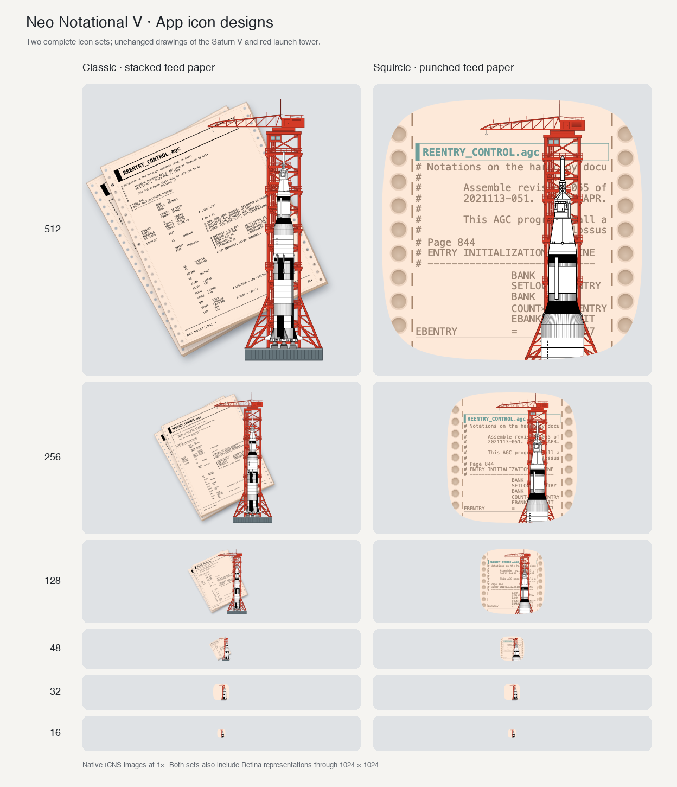

# App icon artwork

The app includes two icon sets: classic pages and a squircle.
Both sets combine peach Apollo 11 source paper, a red launch tower, and a Saturn V.
The squircle is the default.
See [SOURCES.md](SOURCES.md) for artwork credits.

## Components

| File | Purpose |
| --- | --- |
| `source-page.svg` | Two sheets of `#FDE9D9` continuous-feed paper with the AGC code listing. |
| `squircle-paper.svg` | Peach squircle with shaded feed holes and perforations along both sides. |
| `launch-tower.svg` | Red crane and launch tower in a flat front view. |
| `saturn-v.svg` | Vertical Saturn V drawing for sizes of 128 pixels and larger. |
| `small/saturn-v-48.svg` | Rocket with twice the main drawing's width. |
| `small/saturn-v-32.svg` | Rocket with 2.5 times the main drawing's width. |
| `small/saturn-v-16.svg` | Rocket with 3.5 times the main drawing's width. |
| `small/squircle-background.svg` | Blank peach background for the 32px and 16px designs. |

Each SVG uses a transparent 1024 × 1024 canvas.
The composition puts the crane behind the rocket.
At 48px and larger, the squircle uses one upright sheet and the original code listing.
The squircle uses larger code text, cropped to the paper margins.
Its SVG retains all 59 source rows, including rows outside the visible crop.
Its enlarged foreground is clipped to the squircle outline.
The crane antenna touches the top edge, and the gray platform falls below the bottom edge.
The Saturn V has an additional 2× scale anchored at its own antenna tip.
The hole marks have opaque shading to preserve the solid background.
Both sets use the same blank squircle and foreground at 32px and 16px.
Earlier white-paper and perspective-crane revisions are preserved in `revisions/`.

## Compose the SVGs

Run this command from the repository root:

```sh
python3 docs/artwork/app-icon/compose.py
```

This command needs only Python's standard library.
It updates `icon-composition.svg` (classic) and `icon-squircle.svg`.
It writes four composed SVGs per set, plus HTML previews, to `build/app-icon-design/`.
The main composition serves the 128px, 256px, and 512px sizes.
Separate compositions serve 48px, 32px, and 16px.

## Build the app icon

Use macOS with Google Chrome and Python with Pillow installed.
The current resource was rendered with Pillow 12.2.0 and Chrome 153.0.8010.53.

```sh
python3 -m pip install 'Pillow==12.2.0'
python3 docs/artwork/app-icon/build-icon.py
```

The build script composes the SVGs and renders both sets.
It writes the default squircle to `Resources/Images/Notality.icns` and the classic set to `Resources/Images/NotalityClassic.icns`.
Chrome runs with a temporary profile and closes after each render.
The script writes intermediate PNGs into `NeoNotationalV-classic.iconset/` and `NeoNotationalV-squircle.iconset/` under `build/app-icon-design/`.

The ICNS file contains 1× and 2× entries for 16px, 32px, 128px, 256px, and 512px, plus a 48px entry.
Each Retina entry uses its logical size's design.
For example, the 16px Retina entry uses the 16px rocket and squircle at 32 × 32 pixels.
The script decodes every ICNS entry and checks its pixels against the rendered PNG before replacing the resource.

To save a candidate without replacing the app resource, use `--output`:

```sh
python3 docs/artwork/app-icon/build-icon.py --style squircle --output build/candidate.icns
```

Use `--chrome /path/to/chrome` to select another Chrome executable.
Use `--style classic` to build only the classic set.

## Package both designs

The Xcode target copies both ICNS files into the app's resources.
The `NV_APP_ICON_FILE` build setting selects the default through `CFBundleIconFile`.
Both Development and Release use `Notality.icns` by default.

To select the classic icon, append this setting to the normal `xcodebuild` command:

```sh
NV_APP_ICON_FILE=NotalityClassic.icns
```

This selection applies to the entire build.
The app does not change the default at runtime or choose a design by macOS version.
An ICNS file selects representations by size and display scale, not by macOS version.

Apple's current [Icon Composer documentation](https://developer.apple.com/documentation/xcode/creating-your-app-icon-using-icon-composer)
states that Xcode generates older-system icons from the new artwork and replaces the previous icon asset catalog.
Adding both designs alone does not establish an old/new selection rule.

These files are pre-rendered ICNS icons, not a Liquid Glass `.icon` package.
Native decoding was checked on macOS 13.7.8 with Xcode 15.2.
Rendering and background treatment on macOS 26 or later still need a check on that system.
Apple describes the system mask and treatment of irregular icons in
[Adopting Liquid Glass](https://developer.apple.com/documentation/technologyoverviews/adopting-liquid-glass).

## Preview

Run this command on macOS with Pillow to compare the packaged icons:

```sh
python3 docs/artwork/app-icon/compare-icons.py
```



The earlier comparison with the previous app icon remains in `icon-comparison.png`.
