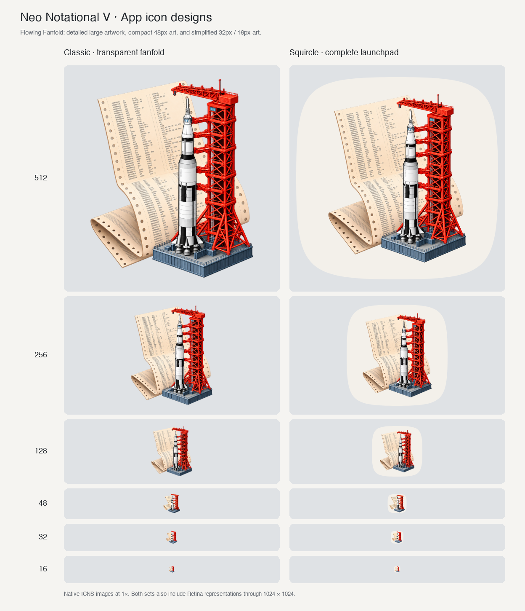

# App icon artwork

The Flowing Fanfold design combines peach continuous-feed paper, a black-and-white
Saturn V, a red isometric launch tower and a blue-gray raised platform. The full
rocket, crane, paper curl and platform stay inside every composition.

## Current delivery status

The classic and static squircle ICNS resources have been replaced with Flowing
Fanfold. The modern Icon Composer source has also been updated, but its compiled
`Resources/Images/Assets.car` still contains the previous artwork. This host has
macOS 13.7.8 and Xcode 15.2; the pinned Xcode 26.0.1 compiler is unavailable.
`Tests/AppIcons/check-resources.py` deliberately reports the stale catalog until
it is regenerated. The existing modern icon remains active on macOS 26 and later
until that final compile-and-copy step is completed.

## Masters and variants

| File | Use |
| --- | --- |
| `fanfold/selected-composition.png` | Exact selected Library composition. |
| `fanfold/full.png` | Detailed transparent master for 128, 256 and 512 pt icons. |
| `fanfold/compact.png` | Wider rocket, larger tower braces and simplified print for 48 pt. |
| `fanfold/micro.png` | Broad shapes and blank paper for 16 and 32 pt. |
| `fanfold/provenance.json` | Source Library identity and master hashes. |
| `fanfold/generation-prompts.json` | Built-in imagegen adaptation briefs. |
| `icon-composition.svg` | Generated classic composition. |
| `icon-squircle.svg` | Generated static squircle composition. |
| `NeoNotationalV.icon/Assets/artwork.png` | Opaque modern shared artwork, ready to compile. |

All master PNGs retain their generated alpha. `compose.py` fits the visible
subject within a safe area using alpha >= 64 to determine its bounds; it does
not alter the master pixels. The static squircle clips the composition to its
outline. Its warm off-white background separates the peach fanfold from the tile.
The modern source uses the same detailed composition on a full canvas, with
clearance for the system mask.

Small icons use distinct generated artwork rather than a resized detailed
master. Both ICNS sets retain their own framing and background at small sizes.
Every Retina representation uses its logical size's master: 16 pt at 2x uses
the micro artwork even though the encoded bitmap is 32 pixels wide. The modern
catalog uses one shared image across display sizes and appearance treatments.
No independent dark or tintable artwork is authored.

## Rebuild the ICNS sets

Use macOS with Google Chrome and Python with Pillow installed:

```sh
python3 -B docs/artwork/app-icon/build-icon.py
python3 -B docs/artwork/app-icon/compare-icons.py
python3 -B docs/artwork/app-icon/prepare-modern-icon.py
```

The existing builder composes SVGs, renders with an isolated Chrome profile,
packages eleven representations per ICNS, and checks every decoded entry against
its rendered PNG before replacing the resource. Intermediates remain in
`build/app-icon-design/`. `--style classic` or `--style squircle` builds one set;
`--output build/candidate.icns` saves a single candidate elsewhere.

## Complete the modern replacement

On a Mac with Xcode 26.0.1 installed:

```sh
python3 -B docs/artwork/app-icon/build-modern-icon.py
cp build/modern-icon/Assets.car Resources/Images/Assets.car
cp build/modern-icon/Assets.car.json Resources/Images/Assets.car.json
python3 -B Tests/AppIcons/check-resources.py
python3 -B Tests/AppIcons/run.py
```

Do not edit the manifest hashes to conceal a stale catalog. The compiler rejects
flattened fallbacks that can override the separate classic design. The app keeps
`CFBundleIconFile=NotalityClassic.icns` and `CFBundleIconName=NeoNotationalV`:
macOS 26+ selects the compiled catalog; earlier systems select the classic ICNS.
`Notality.icns` remains a separately bundled static squircle alternative.

The system-rendered modern appearance must be checked on macOS 26. The prepared
square artwork and static squircle preview do not establish its final system
mask, lighting, dark appearance or tintable treatment.

## History and comparison

`revisions/03-peach-flat-launchpad/` preserves the previous SVG components,
build/composition scripts, comparison and system PNGs, both ICNS resources,
modern source and compiled catalog. Revisions 01 and 02 retain the earlier
white-paper and perspective-tower designs. Restore a historical snapshot to
this directory before using its scripts; snapshot-relative paths are not an
independent build workspace. Legacy top-level component SVGs remain as unused
reference assets.



The complete comparison and current validation status are in `icon-comparison.png`
and `fanfold/validation.json`.
